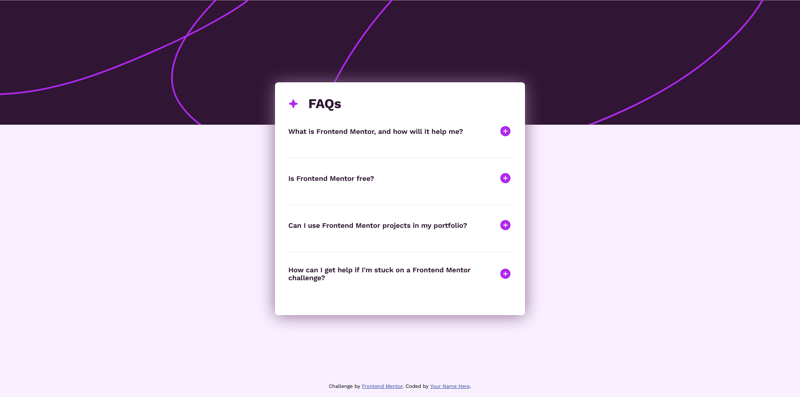
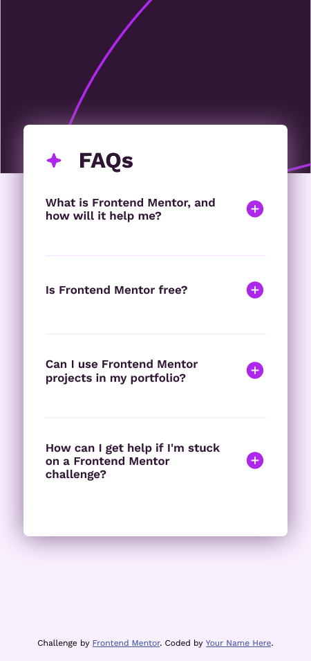

# Frontend Mentor - FAQ accordion solution

This is a solution to the [FAQ accordion challenge on Frontend Mentor](https://www.frontendmentor.io/challenges/faq-accordion-wyfFdeBwBz). Frontend Mentor challenges help you improve your coding skills by building realistic projects.

## Table of contents

- [Overview](#overview)
  - [The challenge](#the-challenge)
  - [Screenshot](#screenshot)
  - [Links](#links)
- [My process](#my-process)
  - [Built with](#built-with)
- [Author](#author)

## Overview

Built out this FAQ accordion frontend-mentor challenge and got it looking as close to the design as possible.

### The challenge

My users are able to:

- Hide/Show the answer to a question when the question is clicked
- Navigate the questions and hide/show answers using keyboard navigation alone
- View the optimal layout for the interface depending on their device's screen size
- See hover and focus states for all interactive elements on the page

### Screenshot

### Links

- Solution URL: [Add solution URL here](https://your-solution-url.com)
- Live Site URL: [Add live site URL here](https://your-live-site-url.com)

## My process

1. I initialized my project as a public repository on [GitHub](https://github.com/). Creating a repo made it easier to share my code with the community if I needed help.

2. Configure my repository to publish your code to a web address.

3. Looked through the designs to start planning out how you'll tackle the project.

4. Before adding any styles, I structured my content with HTML.

5. I write out the base styles for your project, including general content styles, such as `font-family` and `font-size`.

6. Started adding styles to the top of the page and work down.

### Built with

- Semantic HTML5 markup
- CSS custom properties
- Javascript
- Flexbox
- Mobile-first workflow

## Author

- Website - [quietdev](https://linktr.ee/quiet.dev)
- Frontend Mentor - [@Udeme01](https://www.frontendmentor.io/profile/Udeme01)
- Instagram - [@the_quietdev](https://www.instagram.com/the_quietdev)
